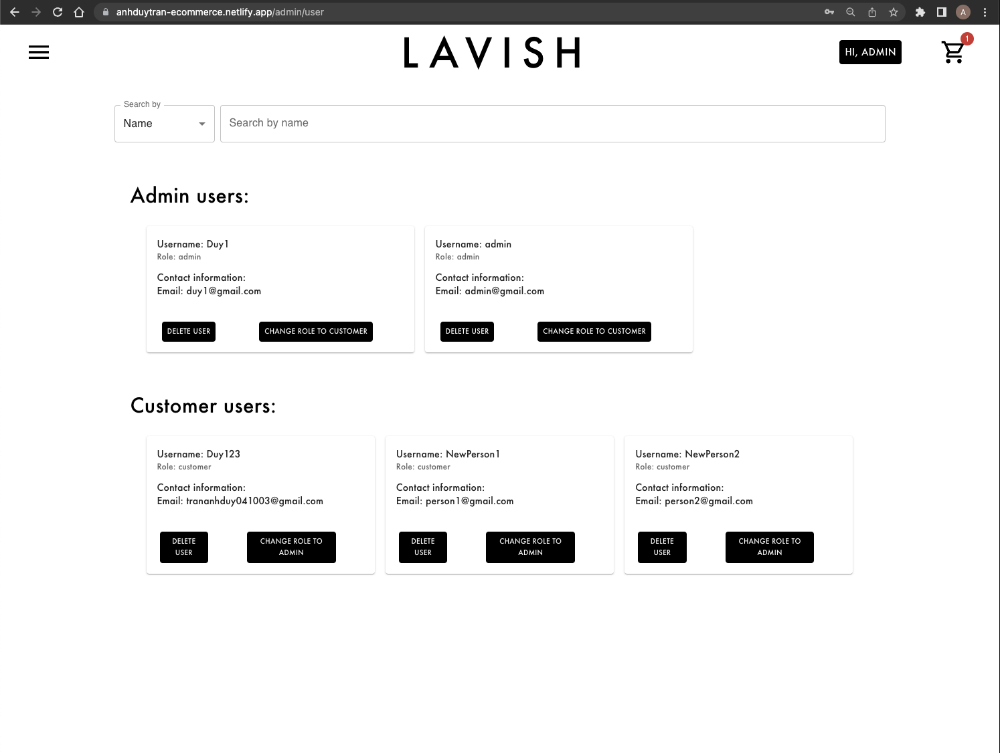

<h1>MERN E-Commerce Web App</h1>

*under-development*

<h2>Introduction</h2>

This is my MERN stack e-commerce web application on GitHub. I've used MongoDB to store all the users and products data, React for the responsive front-end, Node.js for the back-end and Express for routing. Security is priority and I've implemented bcrypt for user authentication and JWT for authorization. This project demonstrates my ability to develop a full-stack web application that is good looking, efficient and secure. Take a look and let me know what you think

<h2>Current state of the project</h2>

**Progress so far:**
* Stable backend
* Mostly working frontend with responsive UI for both customer and admin usecase.

**Todo**
* Save user shopping cart to the database.

<h3>Customer usecase:</h3>

*DEMO (old version)*
*visit [this link](https://anhduytran-ecommerce.netlify.app/) for the live version*

<h3>Admin usecase</h3>

* **Login credential:**

*username: admin*

*password: admin12345*
 

<h3>After login using the admin credential, the navigating menu will have two more option for the admin user:</h3>

* **Edit products (includes add new product to the database, delete or modify the price of existing products)**

https://user-images.githubusercontent.com/113171462/215924123-8513ccf1-3eb4-40c8-8037-687bb397cb5e.mov

* **View and update information (role) of registered users**

